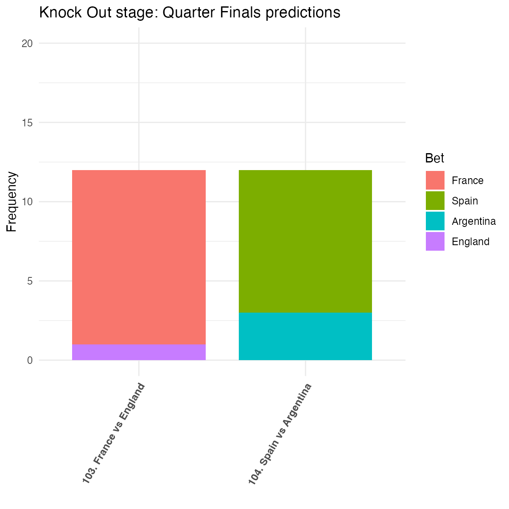
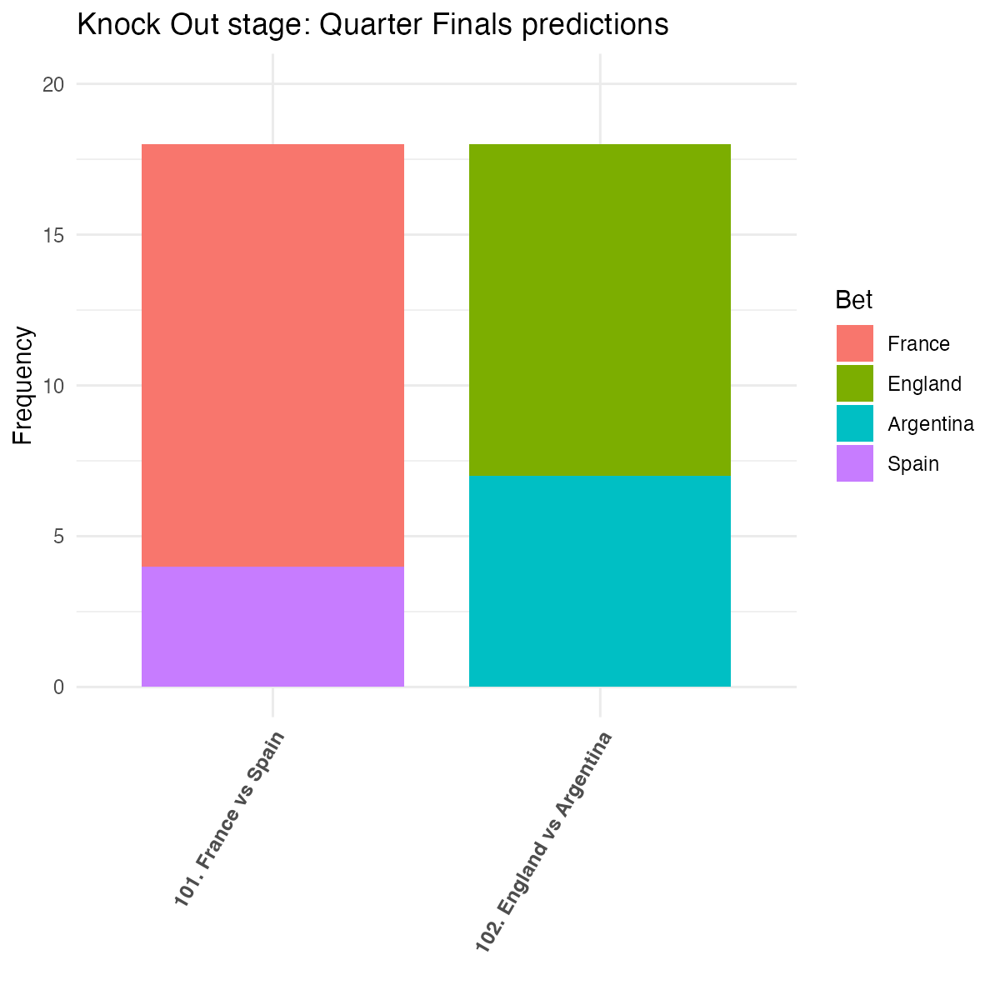
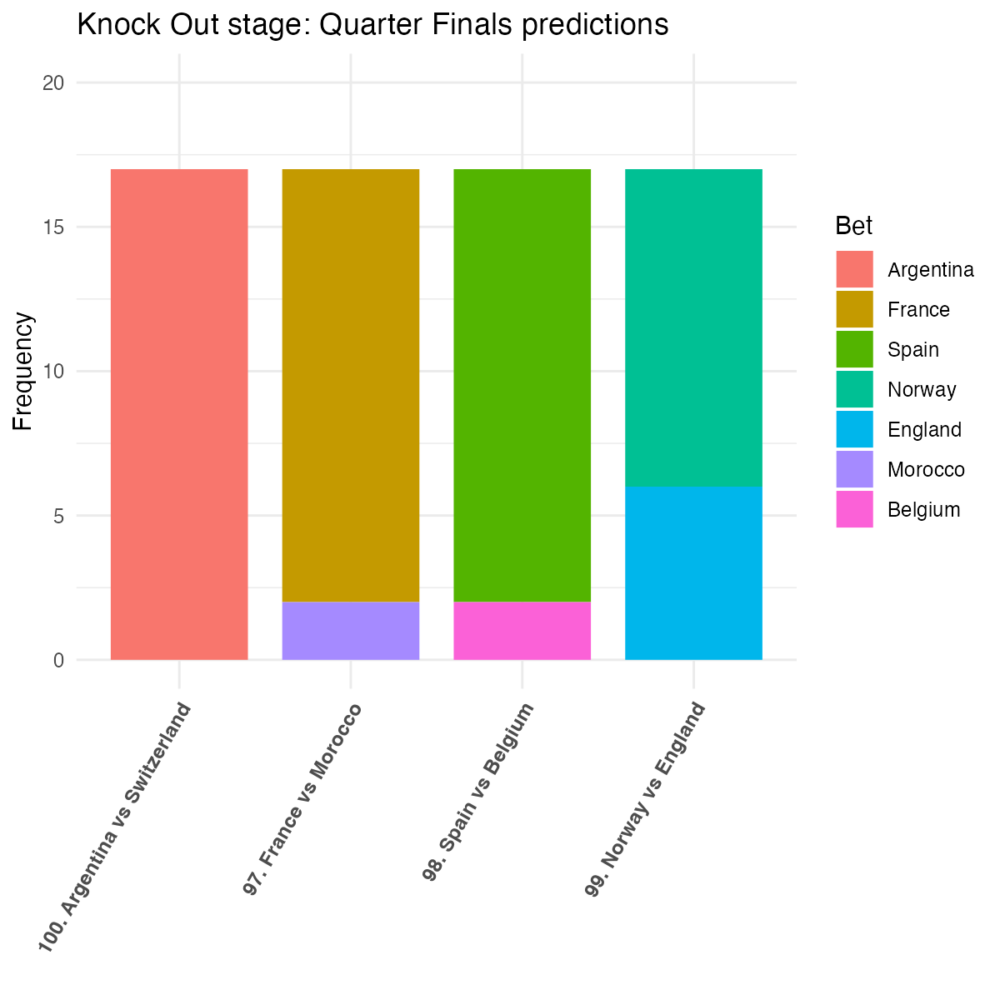
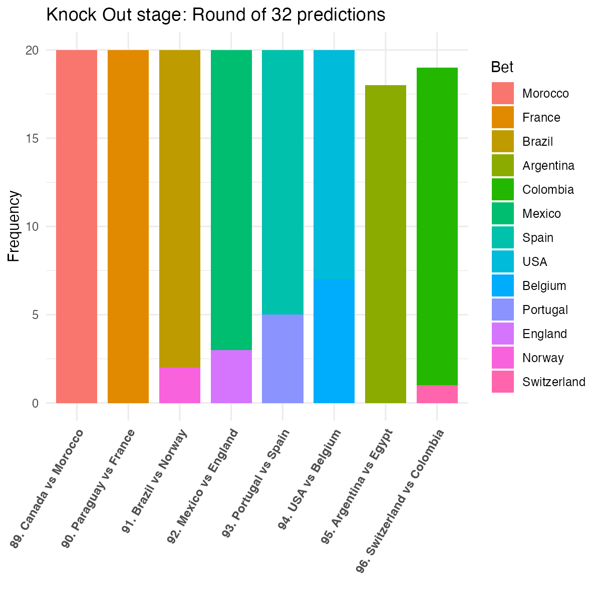
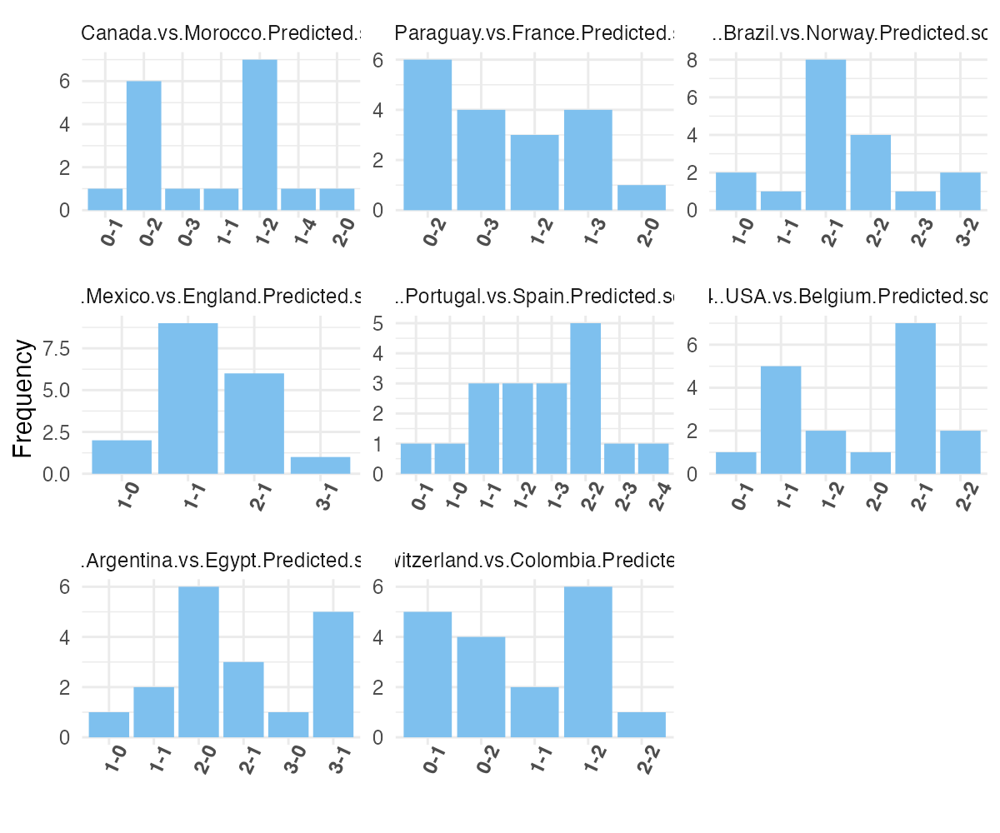
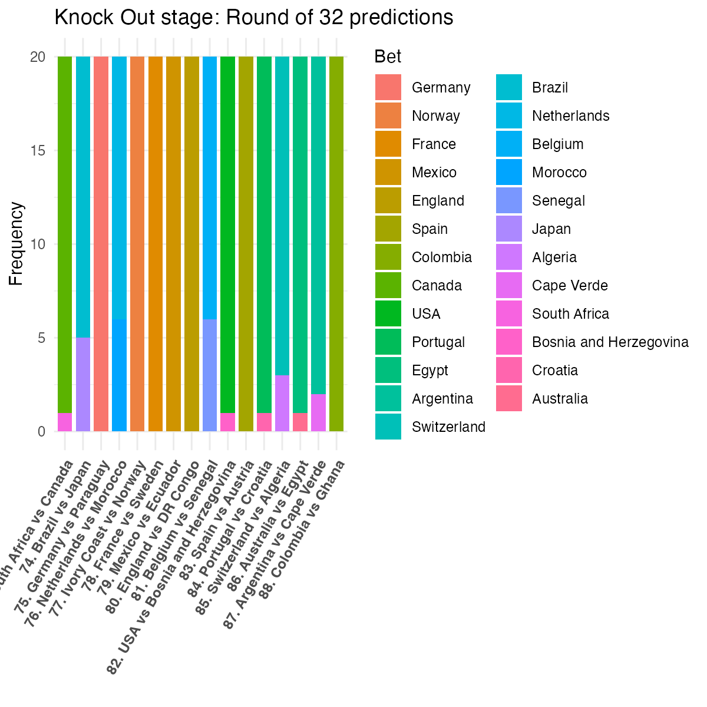
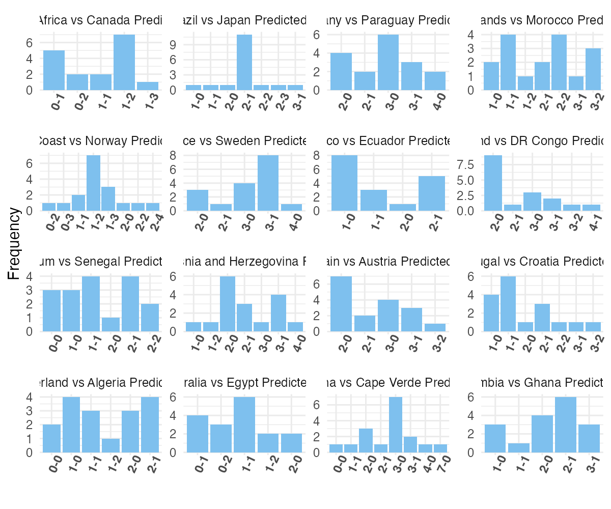

Last Update: Sun 19 Jul 2026 18:05:56 EDT
# **CANADA-USA-MEXICO FIFA WORLD CUP 2026**

---
# Welcome

--- 
FIFA World Cup 2026 results
---

 ## Total Scores
| Participant_ID | Name                          | GS1 | GS2 | GS3 | K16 | K16_bonus | KO8 | KO8_bonus | QF  | QF_bonus | SF  | SF_bonus | Fr  | F_bonus | Total |
| -------------- | ----------------------------- | --- | --- | --- | --- | --------- | --- | --------- | --- | -------- | --- | -------- | --- | ------- | ----- |
| 003            | Valentin OURRY                | 15  | 17  | 16  | 14  | 8         | 4   | 0         | 3   | 1        | 1   | 1        | 1   | 0       | 81    |
| 016            | Ruben G                       | 13  | 16  | 15  | 14  | 5         | 5   | 1         | 4   | 0        | 1   | 1        | 1   | 0       | 76    |
| 007            | Rodrigo                       | 13  | 16  | 16  | 14  | 5         | 5   | 0         | 4   | 1        | 0   | 0        | 1   | 0       | 75    |
| 011            | Ernesto                       | 14  | 17  | 17  | 14  | 2         | 4   | 0         | 4   | 0        | 1   | 0        | 1   | 0       | 74    |
| 012            | Roberto Ponce                 | 13  | 18  | 15  | 13  | 4         | 4   | 0         | 3   | 0        | 2   | 0        | 0   | 0       | 72    |
| 002            | Alfonso Fajardo               | 13  | 15  | 16  | 14  | 2         | 4   | 0         | 3   | 2        | 0   | 0        | 1   | 0       | 70    |
| 006            | Luis L                        | 12  | 17  | 15  | 14  | 6         | 4   | 0         | NA  | NA       | 1   | 1        | NA  | NA      | 70    |
| 001            | Jonathan Gallego              | 13  | 17  | 16  | 14  | 3         | 3   | 0         | 2   | 0        | 0   | 0        | NA  | NA      | 68    |
| 005            | Ruben Sanchez Corona          | 13  | 14  | 15  | 14  | 1         | 5   | 0         | 4   | 1        | 1   | 0        | NA  | NA      | 68    |
| 015            | Claudio                       | 14  | 16  | 13  | 13  | 3         | 3   | 0         | 4   | 0        | 0   | 0        | 1   | 0       | 67    |
| 014            | Ahmed Felfel                  | 14  | 15  | 13  | 12  | 2         | 7   | 0         | 2   | 0        | 0   | 0        | 1   | 0       | 66    |
| 017            | HABIB E                       | 11  | 16  | 12  | 13  | 5         | 4   | 0         | 2   | 0        | 2   | 0        | 1   | 0       | 66    |
| 018            | Mariel                        | 14  | 16  | 13  | 14  | 2         | 4   | 0         | 3   | 0        | NA  | NA       | NA  | NA      | 66    |
| 009            | Vladi                         | 12  | 14  | 16  | 14  | 3         | 4   | 0         | NA  | NA       | 1   | 1        | NA  | NA      | 65    |
| 010            | Daniel Jimenez Gomez          | 11  | 15  | 16  | 13  | 1         | 5   | 0         | 3   | 1        | 0   | 0        | NA  | NA      | 65    |
| 019            | Jhonatan Omar Romero Becerril | 11  | 14  | 14  | 14  | 3         | 4   | 0         | 4   | 0        | 0   | 0        | 0   | 0       | 64    |
| 020            | Julian                        | 9   | 15  | 14  | 13  | 3         | 5   | 0         | 3   | 1        | 0   | 0        | 1   | 0       | 64    |
| 013            | Héctor Zepeda                | 13  | 15  | 15  | 10  | 4         | 3   | 0         | NA  | NA       | 1   | 0        | NA  | NA      | 61    |
| 008            | Gov                           | 7   | 15  | 12  | 14  | 3         | 5   | 0         | 2   | 0        | 0   | 0        | 1   | 0       | 59    |
| 004            | Jalil Rasgado Toledo          | 11  | 15  | 11  | 11  | 2         | 4   | 0         | 3   | 1        | NA  | NA       | NA  | NA      | 58    |

Tie-Breaker 1 : Which team will win the world cup?

 

Tie-Breaker 2: How far will Mexico advance in the tournament?

 

Tie-Breaker 3: How far will Canada advance in the tournament?

 

 ## <u>**Knock Out Final Round Picks**</u>
 
 
| Name                          | Participant_ID | 103. France vs England | 104. Spain vs Argentina |
| ----------------------------- | -------------- | ---------------------- | ----------------------- |
| Alfonso Fajardo               | 002            | France                 | Spain                   |
| Valentin O                    | 003            | France                 | Spain                   |
| Rodrigo                       | 007            | France                 | Spain                   |
| Govind Mohan                  | 008            | France                 | Spain                   |
| Ernesto                       | 011            | France                 | Spain                   |
| Roberto Ponce                 | 012            | France                 | Argentina               |
| Ahmed Felfel                  | 014            | France                 | Spain                   |
| Claudio                       | 015            | France                 | Spain                   |
| Ruben G                       | 016            | France                 | Spain                   |
| Habib Echanove                | 017            | England                | Argentina               |
| Jhonatan Omar Romero Becerril | 019            | France                 | Argentina               |
| Papa de Habib                 | 020            | France                 | Spain                   |

 ## <u>**Score Predictions**</u>

 
| Participant_ID | X103..France.vs.England.Predicted.Score | X104..Spain.vs.Argentina.Predicted.Score |
| -------------- | --------------------------------------- | ---------------------------------------- |
| 002            | 2-1                                     | 2-1                                      |
| 003            | 3-1                                     | 2-2                                      |
| 007            | 2-1                                     | 1-1                                      |
| 008            | 3-3                                     | 2-2                                      |
| 011            | 2-1                                     | 3-1                                      |
| 012            | 3-1                                     | 2-2                                      |
| 014            | 3-1                                     | 2-2                                      |
| 015            | 2-1                                     | 2-1                                      |
| 016            | 2-1                                     | 1-1                                      |
| 017            | 1-2                                     | 2-3                                      |
| 019            | 3-2                                     | 2-2                                      |
| 020            | 2-2                                     | 2-2                                      |

- - - 

 ## <u>**Knock Out Semi-Finals Picks**</u>
 
 
| Name                          | Participant_ID | 101. France vs Spain | 102. England vs Argentina |
| ----------------------------- | -------------- | -------------------- | ------------------------- |
| Jonathan Gallego              | 001            | France               | England                   |
| Alfonso Fajardo               | 002            | France               | England                   |
| Valentin O                    | 003            | France               | Argentina                 |
| Rubén Sánchez               | 005            | France               | Argentina                 |
| Luis L                        | 006            | France               | Argentina                 |
| Rodrigo                       | 007            | France               | England                   |
| Govind Mohan                  | 008            | France               | England                   |
| Vladi                         | 009            | France               | Argentina                 |
| Daniel Jiménez Gómez        | 010            | France               | England                   |
| Ernesto                       | 011            | Spain                | England                   |
| Roberto Ponce                 | 012            | Spain                | Argentina                 |
| Héctor Zepeda                | 013            | Spain                | England                   |
| Ahmed Felfel                  | 014            | France               | England                   |
| Claudio                       | 015            | France               | England                   |
| Ruben G                       | 016            | France               | Argentina                 |
| Habib Echanove                | 017            | Spain                | Argentina                 |
| Jhonatan Omar Romero Becerril | 019            | France               | England                   |
| Julian SaSa                   | 020            | France               | England                   |

 ## <u>**Score Predictions**</u>

 
| Participant_ID | X101..France.vs.Spain.Predicted.Score | X102..England.vs.Argentina.Predicted.Score |
| -------------- | ------------------------------------- | ------------------------------------------ |
| 001            | 2-1                                   | 2-1                                        |
| 002            | 2-1                                   | 3-2                                        |
| 003            | 2-1                                   | 1-2                                        |
| 005            | 2-1                                   | 1-1                                        |
| 006            | 2-1                                   | 1-2                                        |
| 007            | 2-1                                   | 1-1                                        |
| 008            | 2-1                                   | 2-2                                        |
| 009            | 2-1                                   | 1-2                                        |
| 010            | 3-2                                   | 4-2                                        |
| 011            | 1-2                                   | 3-2                                        |
| 012            | 2-2                                   | 1-1                                        |
| 013            | 2-2                                   | 2-1                                        |
| 014            | 3-2                                   | 2-1                                        |
| 015            | 2-1                                   | 2-2                                        |
| 016            | 2-1                                   | 1-2                                        |
| 017            | 1-2                                   | 1-1                                        |
| 019            | 2-2                                   | 2-1                                        |
| 020            | 2-1                                   | 3-2                                        |

- - - 

 ## <u>**Knock Out Quarter Finals Picks**</u>
 
 
| Name                          | Participant_ID | 97. France vs Morocco | 98. Spain vs Belgium | 99. Norway vs England | 100. Argentina vs Switzerland |
| ----------------------------- | -------------- | --------------------- | -------------------- | --------------------- | ----------------------------- |
| Yonatan Galletas              | 001            | France                | Belgium              | Norway                | Argentina                     |
| Alfonso Fajardo               | 002            | France                | Spain                | Norway                | Argentina                     |
| Valentin O                    | 003            | France                | Spain                | Norway                | Argentina                     |
| Jalil Rasgado                 | 004            | France                | Spain                | Norway                | Argentina                     |
| Rubén Sánchez               | 005            | France                | Spain                | England               | Argentina                     |
| Rodrigo                       | 007            | France                | Spain                | England               | Argentina                     |
| Govind Mohan                  | 008            | France                | Belgium              | Norway                | Argentina                     |
| Daniel Jimenez Gomez          | 010            | France                | Spain                | Norway                | Argentina                     |
| Ernesto                       | 011            | France                | Spain                | England               | Argentina                     |
| Roberto Ponce                 | 012            | France                | Spain                | Norway                | Argentina                     |
| Ahmed Felfel                  | 014            | Morocco               | Spain                | Norway                | Argentina                     |
| Claudio                       | 015            | France                | Spain                | England               | Argentina                     |
| Ruben G                       | 016            | France                | Spain                | England               | Argentina                     |
| Habib E                       | 017            | Morocco               | Spain                | Norway                | Argentina                     |
| Mariel                        | 018            | France                | Spain                | Norway                | Argentina                     |
| Jhonatan Omar Romero Becerril | 019            | France                | Spain                | England               | Argentina                     |
| Julian SaSa                   | 020            | France                | Spain                | Norway                | Argentina                     |

 ## <u>**Score Predictions**</u>

 
| Participant_ID | X97..France.vs.Morocco.Predicted.Score | X98..Spain.vs.Belgium.Predicted.Score | X99..Norway.vs.England.Predicted.Score | X100..Argentina.vs.Switzerland.Predicted.Score |
| -------------- | -------------------------------------- | ------------------------------------- | -------------------------------------- | ---------------------------------------------- |
| 001            | 2-1                                    | 1-1                                   | 2-1                                    | 3-1                                            |
| 002            | 3-2                                    | 2-1                                   | 2-0                                    | 1-1                                            |
| 003            | 3-1                                    | 2-0                                   | 1-1                                    | 2-0                                            |
| 004            | 3-1                                    | 2-1                                   | 2-2                                    | 2-0                                            |
| 005            | 2-1                                    | 2-1                                   | 2-2                                    | 3-1                                            |
| 007            | 2-1                                    | 1-0                                   | 1-1                                    | 2-0                                            |
| 008            | 2-2                                    | 2-3                                   | 2-2                                    | 2-0                                            |
| 010            | 3-2                                    | 2-1                                   | 3-2                                    | 3-2                                            |
| 011            | 2-1                                    | 1-0                                   | 1-2                                    | 2-1                                            |
| 012            | 3-2                                    | 2-0                                   | 2-2                                    | 2-1                                            |
| 014            | 2-3                                    | 4-2                                   | 2-1                                    | 2-0                                            |
| 015            | 2-1                                    | 1-0                                   | 2-2                                    | 2-1                                            |
| 016            | 1-0                                    | 2-0                                   | 1-2                                    | 1-0                                            |
| 017            | 2-2                                    | 2-0                                   | 2-1                                    | 3-1                                            |
| 018            | 2-1                                    | 1-0                                   | 2-1                                    | 2-0                                            |
| 019            | 3-2                                    | 2-2                                   | 1-2                                    | 3-1                                            |
| 020            | 3-2                                    | 2-1                                   | 3-1                                    | 3-2                                            |

- - - 

 ## <u>**Knock Out Stage Round of 16 Picks**</u>
 
 
| Name                          | Participant_ID | 89. Canada vs Morocco | 90. Paraguay vs France | 91. Brazil vs Norway | 92. Mexico vs England | 93. Portugal vs Spain | 94. USA vs Belgium | 95. Argentina vs Egypt | 96. Switzerland vs Colombia |
| ----------------------------- | -------------- | --------------------- | ---------------------- | -------------------- | --------------------- | --------------------- | ------------------ | ---------------------- | --------------------------- |
| Jonathan                      | 001            | Morocco               | France                 | Brazil               | Mexico                | Portugal              | USA                | Argentina              | Colombia                    |
| Alfonso Fajardo               | 002            | Morocco               | France                 | Brazil               | Mexico                | Spain                 | USA                | Argentina              | Colombia                    |
| Valentin O                    | 003            | Morocco               | France                 | Brazil               | Mexico                | Spain                 | USA                | Argentina              | Colombia                    |
| Jalil                         | 004            | Morocco               | France                 | Brazil               | Mexico                | Spain                 | USA                | Argentina              | Colombia                    |
| Rubén Sánchez               | 005            | Morocco               | France                 | Brazil               | England               | Spain                 | USA                | Argentina              | Colombia                    |
| Luis L                        | 006            | Morocco               | France                 | Brazil               | Mexico                | Spain                 | USA                | Argentina              | Colombia                    |
| Rodrigo                       | 007            | Morocco               | France                 | Brazil               | Mexico                | Spain                 | Belgium            | Argentina              | Colombia                    |
| Gov                           | 008            | Morocco               | France                 | Brazil               | England               | Spain                 | Belgium            | NA                     | Colombia                    |
| Vladi                         | 009            | Morocco               | France                 | Brazil               | Mexico                | Portugal              | Belgium            | Argentina              | Colombia                    |
| Daniel Jimenez Gomez          | 010            | Morocco               | France                 | Norway               | Mexico                | Spain                 | USA                | Argentina              | Colombia                    |
| Ernesto                       | 011            | Morocco               | France                 | Brazil               | Mexico                | Spain                 | USA                | Argentina              | Colombia                    |
| Roberto Ponce                 | 012            | Morocco               | France                 | Brazil               | Mexico                | Spain                 | USA                | Argentina              | Colombia                    |
| Héctor Zepeda                | 013            | Morocco               | France                 | Brazil               | Mexico                | Portugal              | USA                | Argentina              | Colombia                    |
| Ahmed Felfel                  | 014            | Morocco               | France                 | Brazil               | England               | Spain                 | Belgium            | Argentina              | Switzerland                 |
| Claudio                       | 015            | Morocco               | France                 | Brazil               | Mexico                | Portugal              | USA                | Argentina              | Colombia                    |
| Ruben G                       | 016            | Morocco               | France                 | Brazil               | Mexico                | Spain                 | Belgium            | Argentina              | Colombia                    |
| Habib                         | 017            | Morocco               | France                 | Brazil               | Mexico                | Spain                 | USA                | Argentina              | Colombia                    |
| Mariel                        | 018            | Morocco               | France                 | Brazil               | Mexico                | Portugal              | Belgium            | Argentina              | Colombia                    |
| Jhonatan Omar Romero Becerril | 019            | Morocco               | France                 | Brazil               | Mexico                | Spain                 | USA                | Argentina              | Colombia                    |
| Julian SaSa                   | 020            | Morocco               | France                 | Norway               | Mexico                | Spain                 | Belgium            | NA                     | NA                          |

 ## <u>**Score Predictions**</u>

 
| Participant_ID | X89..Canada.vs.Morocco.Predicted.score | X90..Paraguay.vs.France.Predicted.score | X91..Brazil.vs.Norway.Predicted.score | X92..Mexico.vs.England.Predicted.score | X93..Portugal.vs.Spain.Predicted.score | X94..USA.vs.Belgium.Predicted.score | X95..Argentina.vs.Egypt.Predicted.score | X96..Switzerland.vs.Colombia.Predicted.score |
| -------------- | -------------------------------------- | --------------------------------------- | ------------------------------------- | -------------------------------------- | -------------------------------------- | ----------------------------------- | --------------------------------------- | -------------------------------------------- |
| 001            | 1-2                                    | 0-3                                     | 2-1                                   | 1-1                                    | 2-2                                    | 2-1                                 | 3-1                                     | 0-2                                          |
| 002            | 0-2                                    | 0-3                                     | 2-1                                   | 1-0                                    | 1-2                                    | 2-0                                 | 3-0                                     | 1-1                                          |
| 003            | 1-2                                    | 1-3                                     | 2-2                                   | 2-1                                    | 1-3                                    | 1-1                                 | 2-0                                     | 1-2                                          |
| 004            | 0-2                                    | 0-2                                     | 3-2                                   | 2-1                                    | 2-2                                    | 1-1                                 | 1-1                                     | 0-2                                          |
| 005            | 0-2                                    | 1-2                                     | 2-1                                   | 1-1                                    | 1-3                                    | 2-1                                 | 2-0                                     | 0-1                                          |
| 006            | 1-2                                    | 0-2                                     | 1-0                                   | 1-0                                    | 1-2                                    | 1-1                                 | 2-0                                     | 0-1                                          |
| 007            | 0-2                                    | 0-2                                     | 2-1                                   | 1-1                                    | 1-2                                    | 1-1                                 | 2-0                                     | 0-1                                          |
| 008            | 1-3                                    | 0-5                                     | 3-1                                   | 2-2                                    | 1-3                                    | 0-2                                 | NA                                      | 0-2                                          |
| 009            | 1-1                                    | 1-2                                     | 2-1                                   | 1-1                                    | 1-0                                    | 1-2                                 | 2-0                                     | 0-1                                          |
| 010            | 1-4                                    | 1-3                                     | 2-3                                   | 3-1                                    | 2-4                                    | 2-1                                 | 2-1                                     | 1-2                                          |
| 011            | 1-2                                    | 0-3                                     | 3-2                                   | 2-1                                    | 1-3                                    | 2-1                                 | 3-1                                     | 1-2                                          |
| 012            | 0-2                                    | 0-2                                     | 2-1                                   | 1-1                                    | 2-2                                    | 1-1                                 | 3-1                                     | 1-1                                          |
| 013            | 1-2                                    | 1-2                                     | 1-0                                   | 1-1                                    | 2-2                                    | 2-1                                 | 2-1                                     | 1-2                                          |
| 014            | 0-3                                    | 1-3                                     | 2-2                                   | 1-1                                    | 2-3                                    | 1-2                                 | 3-1                                     | 2-2                                          |
| 015            | 0-2                                    | 0-2                                     | 2-1                                   | 1-1                                    | 1-1                                    | 2-1                                 | 2-1                                     | 1-2                                          |
| 016            | 0-1                                    | 0-2                                     | 2-1                                   | 1-1                                    | 0-1                                    | 0-1                                 | 1-0                                     | 0-1                                          |
| 017            | 1-2                                    | 0-3                                     | 2-2                                   | 2-1                                    | 1-1                                    | 2-1                                 | 1-1                                     | 1-2                                          |
| 018            | 2-0                                    | 2-0                                     | 1-1                                   | 2-1                                    | 1-1                                    | 2-2                                 | 3-1                                     | 0-2                                          |
| 019            | 1-2                                    | 1-3                                     | 2-2                                   | 2-1                                    | 2-2                                    | 2-2                                 | 2-0                                     | 0-2                                          |
| 020            | 0-1                                    | 0-2                                     | 2-2                                   | 2-0                                    | 1-3                                    | 1-1                                 | NA                                      | NA                                           |

- - - 

- - - 

 ## <u>**Knock Out Stage Round of 32 Picks**</u>
 
 
| Name                          | Participant_ID | South Africa vs Canada | 74. Brazil vs Japan | 75. Germany vs Paraguay | 76. Netherlands vs Morocco | 77. Ivory Coast vs Norway | 78. France vs Sweden | 79. Mexico vs Ecuador | 80. England vs DR Congo | 81. Belgium vs Senegal | 82. USA vs Bosnia and Herzegovina | 83. Spain vs Austria | 84. Portugal vs Croatia | 85. Switzerland vs Algeria | 86. Australia vs Egypt | 87. Argentina vs Cape Verde | 88. Colombia vs Ghana |
| ----------------------------- | -------------- | ---------------------- | ------------------- | ----------------------- | -------------------------- | ------------------------- | -------------------- | --------------------- | ----------------------- | ---------------------- | --------------------------------- | -------------------- | ----------------------- | -------------------------- | ---------------------- | --------------------------- | --------------------- |
| Jonathan                      | 001            | Canada                 | Brazil              | Germany                 | Netherlands                | Norway                    | France               | Mexico                | England                 | Belgium                | USA                               | Spain                | Portugal                | Switzerland                | Egypt                  | Argentina                   | Colombia              |
| Alfonso Fajardo               | 002            | Canada                 | Brazil              | Germany                 | Morocco                    | Norway                    | France               | Mexico                | England                 | Belgium                | USA                               | Spain                | Portugal                | Algeria                    | Egypt                  | Argentina                   | Colombia              |
| Valentin                      | 003            | Canada                 | Brazil              | Germany                 | Morocco                    | Norway                    | France               | Mexico                | England                 | Senegal                | USA                               | Spain                | Portugal                | Switzerland                | Egypt                  | Argentina                   | Colombia              |
| Jalil Rasgado Toledo          | 004            | Canada                 | Japan               | Germany                 | Netherlands                | Norway                    | France               | Mexico                | England                 | Senegal                | USA                               | Spain                | Portugal                | Algeria                    | Egypt                  | Argentina                   | Colombia              |
| Rubén Sánchez               | 005            | Canada                 | Brazil              | Germany                 | Netherlands                | Norway                    | France               | Mexico                | England                 | Belgium                | USA                               | Spain                | Portugal                | Switzerland                | Egypt                  | Argentina                   | Colombia              |
| Luis L                        | 006            | Canada                 | Brazil              | Germany                 | Netherlands                | Norway                    | France               | Mexico                | England                 | Belgium                | USA                               | Spain                | Portugal                | Switzerland                | Egypt                  | Argentina                   | Colombia              |
| Rodrigo                       | 007            | Canada                 | Brazil              | Germany                 | Netherlands                | Norway                    | France               | Mexico                | England                 | Belgium                | USA                               | Spain                | Portugal                | Switzerland                | Egypt                  | Argentina                   | Colombia              |
| Govind Mohan                  | 008            | Canada                 | Brazil              | Germany                 | Morocco                    | Norway                    | France               | Mexico                | England                 | Belgium                | USA                               | Spain                | Portugal                | Switzerland                | Egypt                  | Cape Verde                  | Colombia              |
| Vladi                         | 009            | Canada                 | Brazil              | Germany                 | Netherlands                | Norway                    | France               | Mexico                | England                 | Belgium                | USA                               | Spain                | Portugal                | Switzerland                | Egypt                  | Argentina                   | Colombia              |
| Daniel Jimenez Gomez          | 010            | Canada                 | Brazil              | Germany                 | Netherlands                | Norway                    | France               | Mexico                | England                 | Belgium                | Bosnia and Herzegovina            | Spain                | Portugal                | Switzerland                | Egypt                  | Argentina                   | Colombia              |
| Ernesto                       | 011            | Canada                 | Brazil              | Germany                 | Netherlands                | Norway                    | France               | Mexico                | England                 | Belgium                | USA                               | Spain                | Portugal                | Switzerland                | Egypt                  | Argentina                   | Colombia              |
| Roberto Ponce                 | 012            | Canada                 | Japan               | Germany                 | Netherlands                | Norway                    | France               | Mexico                | England                 | Belgium                | USA                               | Spain                | Portugal                | Switzerland                | Egypt                  | Argentina                   | Colombia              |
| Hector Zepeda                 | 013            | Canada                 | Japan               | Germany                 | Netherlands                | Norway                    | France               | Mexico                | England                 | Senegal                | USA                               | Spain                | Portugal                | Switzerland                | Australia              | Cape Verde                  | Colombia              |
| Ahmed Felfel                  | 014            | Canada                 | Japan               | Germany                 | Morocco                    | Norway                    | France               | Mexico                | England                 | Senegal                | USA                               | Spain                | Portugal                | Algeria                    | Egypt                  | Argentina                   | Colombia              |
| Claudio                       | 015            | South Africa           | Brazil              | Germany                 | Morocco                    | Norway                    | France               | Mexico                | England                 | Senegal                | USA                               | Spain                | Portugal                | Switzerland                | Egypt                  | Argentina                   | Colombia              |
| Ruben G                       | 016            | Canada                 | Brazil              | Germany                 | Netherlands                | Norway                    | France               | Mexico                | England                 | Belgium                | USA                               | Spain                | Portugal                | Switzerland                | Egypt                  | Argentina                   | Colombia              |
| Habib Echanove                | 017            | Canada                 | Brazil              | Germany                 | Morocco                    | Norway                    | France               | Mexico                | England                 | Senegal                | USA                               | Spain                | Croatia                 | Switzerland                | Egypt                  | Argentina                   | Colombia              |
| Mariel                        | 018            | Canada                 | Brazil              | Germany                 | Netherlands                | Norway                    | France               | Mexico                | England                 | Belgium                | USA                               | Spain                | Portugal                | Switzerland                | Egypt                  | Argentina                   | Colombia              |
| Jhonatan Omar Romero Becerril | 019            | Canada                 | Brazil              | Germany                 | Netherlands                | Norway                    | France               | Mexico                | England                 | Belgium                | USA                               | Spain                | Portugal                | Switzerland                | Egypt                  | Argentina                   | Colombia              |
| Julian SaSa                   | 020            | Canada                 | Japan               | Germany                 | Netherlands                | Norway                    | France               | Mexico                | England                 | Belgium                | USA                               | Spain                | Portugal                | Switzerland                | Egypt                  | Argentina                   | Colombia              |

 ## <u>**Score Predictions**</u>

 
| Participant_ID | South.Africa.vs.Canada.Predicted.Score | X74..Brazil.vs.Japan.Predicted.Score | X75..Germany.vs.Paraguay.Predicted.Score | X76..Netherlands.vs.Morocco.Predicted.Score | X77..Ivory.Coast.vs.Norway.Predicted.Score | X78..France.vs.Sweden.Predicted.Score | X79..Mexico.vs.Ecuador.Predicted.Score | X80..England.vs.DR.Congo.Predicted.Score | X81..Belgium.vs.Senegal.Predicted.Score | X82..USA.vs.Bosnia.and.Herzegovina.Predicted.Score | X83..Spain.vs.Austria.Predicted.Score | X84..Portugal.vs.Croatia.Predicted.Score | X85..Switzerland.vs.Algeria.Predicted.Score | X86..Australia.vs.Egypt.Predicted.Score | X87..Argentina.vs.Cape.Verde.Predicted.Score | X88..Colombia.vs.Ghana.Predicted.Score |
| -------------- | -------------------------------------- | ------------------------------------ | ---------------------------------------- | ------------------------------------------- | ------------------------------------------ | ------------------------------------- | -------------------------------------- | ---------------------------------------- | --------------------------------------- | -------------------------------------------------- | ------------------------------------- | ---------------------------------------- | ------------------------------------------- | --------------------------------------- | -------------------------------------------- | -------------------------------------- |
| 001            | 1-2                                    | 2-1                                  | 2-0                                      | 2-1                                         | 1-3                                        | 3-1                                   | 1-0                                    | 2-0                                      | 2-1                                     | 3-1                                                | 2-0                                   | 2-0                                      | 1-0                                         | 1-1                                     | 3-0                                          | 1-0                                    |
| 002            | 1-1                                    | 2-1                                  | 4-0                                      | 2-2                                         | 1-2                                        | 3-1                                   | 2-1                                    | 3-0                                      | 1-1                                     | 4-0                                                | 2-0                                   | 1-1                                      | 1-1                                         | 0-2                                     | 3-0                                          | 2-1                                    |
| 003            | 0-1                                    | 2-1                                  | 3-0                                      | 1-1                                         | 1-2                                        | 3-0                                   | 2-0                                    | 2-0                                      | 1-1                                     | 3-1                                                | 3-0                                   | 1-1                                      | 0-0                                         | 1-1                                     | 7-0                                          | 2-1                                    |
| 004            | 1-2                                    | 1-1                                  | 3-0                                      | 2-1                                         | 0-3                                        | 2-0                                   | 1-0                                    | 2-0                                      | 0-0                                     | 2-0                                                | 3-0                                   | 1-0                                      | 0-0                                         | 0-1                                     | 0-0                                          | 2-1                                    |
| 005            | 1-2                                    | 3-1                                  | 4-0                                      | 1-1                                         | 2-0                                        | 3-1                                   | 1-1                                    | 3-1                                      | 1-0                                     | 3-1                                                | 2-0                                   | 1-1                                      | 2-1                                         | 1-2                                     | 4-0                                          | 2-1                                    |
| 006            | 0-1                                    | 2-1                                  | 3-0                                      | 3-1                                         | 1-2                                        | 3-0                                   | 1-0                                    | 2-0                                      | 2-0                                     | 2-0                                                | 3-0                                   | 2-1                                      | 1-0                                         | 0-1                                     | 3-0                                          | 2-0                                    |
| 007            | 0-1                                    | 2-1                                  | 3-1                                      | 1-1                                         | 0-2                                        | 2-1                                   | 1-0                                    | 3-0                                      | 0-0                                     | 2-0                                                | 3-2                                   | 1-0                                      | 1-1                                         | 1-1                                     | 3-0                                          | 2-0                                    |
| 008            | 1-2                                    | 2-1                                  | 3-0                                      | 1-2                                         | 2-2                                        | 3-0                                   | 2-1                                    | 3-2                                      | 1-1                                     | 1-0                                                | 3-0                                   | 2-1                                      | 1-0                                         | 2-0                                     | 2-1                                          | 1-1                                    |
| 009            | 0-2                                    | 2-0                                  | 2-0                                      | 1-0                                         | 1-3                                        | 2-0                                   | 2-1                                    | 2-1                                      | 2-1                                     | 2-1                                                | 2-1                                   | 1-0                                      | 2-0                                         | 1-1                                     | 2-0                                          | 3-1                                    |
| 010            | 1-2                                    | 2-1                                  | 2-0                                      | 1-0                                         | 1-3                                        | 4-0                                   | 1-1                                    | 2-0                                      | 1-0                                     | 1-2                                                | 2-0                                   | 3-1                                      | 1-0                                         | 0-2                                     | 3-1                                          | 2-1                                    |
| 011            | 1-2                                    | 2-1                                  | 2-1                                      | 2-2                                         | 1-2                                        | 3-1                                   | 2-1                                    | 3-1                                      | 2-1                                     | 3-1                                                | 3-1                                   | 2-2                                      | 1-1                                         | 1-2                                     | 3-1                                          | 3-1                                    |
| 012            | 1-1                                    | 2-2                                  | 4-1                                      | 1-1                                         | 1-2                                        | 4-1                                   | 2-1                                    | 1-0                                      | 3-2                                     | 2-0                                                | 3-1                                   | 2-1                                      | 1-0                                         | 1-1                                     | 3-0                                          | 2-0                                    |
| 013            | 1-3                                    | 2-3                                  | 3-1                                      | 3-2                                         | 2-4                                        | 3-0                                   | 1-0                                    | 2-0                                      | 2-2                                     | 2-0                                                | 2-0                                   | 3-2                                      | 2-1                                         | 2-0                                     | 1-1                                          | 3-1                                    |
| 014            | 1-3                                    | 1-2                                  | 2-0                                      | 1-2                                         | 2-2                                        | 3-1                                   | 2-1                                    | 1-0                                      | 1-2                                     | 2-0                                                | 3-1                                   | 1-1                                      | 1-2                                         | 1-2                                     | 2-0                                          | 1-0                                    |
| 015            | 1-1                                    | 2-1                                  | 3-0                                      | 2-2                                         | 1-1                                        | 3-1                                   | 1-1                                    | 2-0                                      | 1-1                                     | 2-1                                                | 2-1                                   | 1-1                                      | 2-1                                         | 1-1                                     | 2-0                                          | 1-0                                    |
| 016            | 0-1                                    | 1-0                                  | 2-0                                      | 1-1                                         | 1-1                                        | 2-0                                   | 1-0                                    | 2-0                                      | 2-1                                     | 2-0                                                | 2-0                                   | 1-0                                      | 2-1                                         | 1-1                                     | 2-0                                          | 1-0                                    |
| 017            | 0-1                                    | 2-1                                  | 3-1                                      | 2-2                                         | 1-2                                        | 3-1                                   | 1-0                                    | 3-0                                      | 0-0                                     | 2-0                                                | 3-1                                   | 1-1                                      | 2-0                                         | 0-1                                     | 3-0                                          | 2-1                                    |
| 018            | 1-2                                    | 2-2                                  | 3-0                                      | 3-2                                         | 1-2                                        | 3-1                                   | 2-1                                    | 2-0                                      | 2-2                                     | 2-1                                                | 3-1                                   | 1-1                                      | 1-1                                         | 0-2                                     | 3-0                                          | 2-0                                    |
| 019            | 0-2                                    | 2-1                                  | 2-1                                      | 3-2                                         | 1-2                                        | 3-1                                   | 1-0                                    | 4-1                                      | 1-0                                     | 3-0                                                | 2-0                                   | 2-1                                      | 2-0                                         | 0-1                                     | 3-0                                          | 2-0                                    |
| 020            | 1-2                                    | 2-2                                  | 3-0                                      | 2-1                                         | 1-2                                        | 4-1                                   | 2-1                                    | 2-0                                      | 1-1                                     | 2-0                                                | 2-0                                   | 2-1                                      | 2-0                                         | 0-2                                     | 2-0                                          | 3-2                                    |

- - - 

- - - 

 ## <u>**Group Stage 3 (GS3) Picks**</u>
 
 
| Name                          | Participant_ID | 49. Switzerland vs Canada | 50 Bosnia and Herzegovina vs Qatar | 51. Morocco vs Haiti | 52. Scotland vs Brazil | 53. South Africa vs South Korea | 54.  Czechia vs Mexico | 55. Curaçao vs Ivory Coast | 56. Ecuador vs Germany | 57.  Tunisia vs Netherlands | 58. Japan vs Sweden | 59. Türkiye vs USA | 60. Paraguay vs Australia | 61. Norway vs France | 62.  Senegal vs Iraq | 63. Cape Verde vs Saudi Arabia | 64.  Uruguay vs Spain | 65. New Zealand vs Belgium | 66. Egypt vs Iran | 67. Panama vs England | 68. Croatia vs Ghana | 69. Colombia vs Portugal | 70. DR Congo Uzbekistan | 71.  Algeria vs Austria | 72. Jordan vs Argentina |
| ----------------------------- | -------------- | ------------------------- | ---------------------------------- | -------------------- | ---------------------- | ------------------------------- | ---------------------- | -------------------------- | ---------------------- | --------------------------- | ------------------- | ------------------ | ------------------------- | -------------------- | -------------------- | ------------------------------ | --------------------- | -------------------------- | ----------------- | --------------------- | -------------------- | ------------------------ | ----------------------- | ----------------------- | ----------------------- |
| Jonathan                      | 001            | Draw                      | Bosnia and Herzegovina             | Morocco              | Brazil                 | South Korea                     | Mexico                 | Ivory Coast                | Germany                | Netherlands                 | Japan               | USA                | Draw                      | France               | Senegal              | Draw                           | Spain                 | Belgium                    | Egypt             | England               | Croatia              | Portugal                 | Draw                    | Draw                    | Argentina               |
| Alfonso Fajardo               | 002            | Canada                    | Bosnia and Herzegovina             | Morocco              | Brazil                 | South Korea                     | Mexico                 | Ivory Coast                | Germany                | Netherlands                 | Japan               | USA                | Draw                      | France               | Senegal              | Draw                           | Spain                 | Belgium                    | Iran              | England               | Croatia              | Portugal                 | DR Congo                | Algeria                 | Argentina               |
| Valentin OURRY                | 003            | Canada                    | Bosnia and Herzegovina             | Morocco              | Brazil                 | South Korea                     | Mexico                 | Ivory Coast                | Germany                | Netherlands                 | Japan               | USA                | Draw                      | France               | Senegal              | Saudi Arabia                   | Spain                 | Belgium                    | Draw              | England               | Croatia              | Portugal                 | DR Congo                | Algeria                 | Argentina               |
| Jalil Rasgado Toledo          | 004            | Draw                      | Draw                               | Morocco              | Brazil                 | South Korea                     | Mexico                 | Ivory Coast                | Germany                | Netherlands                 | Japan               | USA                | Australia                 | Draw                 | Senegal              | Cape Verde                     | Spain                 | Belgium                    | Iran              | England               | Croatia              | Portugal                 | Draw                    | Algeria                 | Argentina               |
| Rubén Sánchez               | 005            | Draw                      | Bosnia and Herzegovina             | Morocco              | Brazil                 | South Korea                     | Mexico                 | Ivory Coast                | Germany                | Netherlands                 | Draw                | USA                | Draw                      | France               | Senegal              | Cape Verde                     | Spain                 | Belgium                    | Egypt             | England               | Draw                 | Portugal                 | DR Congo                | Austria                 | Argentina               |
| Luis L                        | 006            | Canada                    | Bosnia and Herzegovina             | Morocco              | Brazil                 | South Korea                     | Mexico                 | Ivory Coast                | Germany                | Netherlands                 | Japan               | USA                | Paraguay                  | France               | Senegal              | Draw                           | Draw                  | Belgium                    | Egypt             | England               | Croatia              | Portugal                 | DR Congo                | Draw                    | Argentina               |
| Rodrigo                       | 007            | Draw                      | Bosnia and Herzegovina             | Morocco              | Brazil                 | South Korea                     | Mexico                 | Ivory Coast                | Germany                | Netherlands                 | Japan               | USA                | Draw                      | France               | Senegal              | Cape Verde                     | Draw                  | Belgium                    | Egypt             | England               | Croatia              | Draw                     | DR Congo                | Draw                    | Argentina               |
| Gov                           | 008            | Canada                    | Bosnia and Herzegovina             | Morocco              | Brazil                 | South Korea                     | Mexico                 | Ivory Coast                | Germany                | Netherlands                 | Draw                | USA                | Paraguay                  | Norway               | Senegal              | Cape Verde                     | Draw                  | Belgium                    | Iran              | England               | Ghana                | Portugal                 | DR Congo                | Algeria                 | Argentina               |
| Vladi                         | 009            | Canada                    | Bosnia and Herzegovina             | Morocco              | Brazil                 | South Korea                     | Mexico                 | Ivory Coast                | Germany                | Netherlands                 | Draw                | USA                | Draw                      | France               | Senegal              | Cape Verde                     | Spain                 | Belgium                    | Egypt             | England               | Draw                 | Draw                     | DR Congo                | Austria                 | Argentina               |
| Daniel Jimenez Gomez          | 010            | Draw                      | Bosnia and Herzegovina             | Morocco              | Brazil                 | South Korea                     | Mexico                 | Ivory Coast                | Germany                | Netherlands                 | Japan               | USA                | Draw                      | France               | Senegal              | Cape Verde                     | Spain                 | Belgium                    | Egypt             | England               | Croatia              | Draw                     | DR Congo                | Austria                 | Argentina               |
| Ernesto                       | 011            | Draw                      | Bosnia and Herzegovina             | Morocco              | Brazil                 | South Korea                     | Mexico                 | Ivory Coast                | Germany                | Netherlands                 | Japan               | USA                | Draw                      | France               | Senegal              | Draw                           | Spain                 | Belgium                    | Egypt             | England               | Croatia              | Colombia                 | DR Congo                | Draw                    | Argentina               |
| Roberto Ponce                 | 012            | Draw                      | Bosnia and Herzegovina             | Morocco              | Brazil                 | South Korea                     | Mexico                 | Ivory Coast                | Germany                | Netherlands                 | Japan               | USA                | Draw                      | Draw                 | Senegal              | Cape Verde                     | Spain                 | Belgium                    | Egypt             | England               | Draw                 | Draw                     | DR Congo                | Draw                    | Argentina               |
| Héctor Zepeda                | 013            | Draw                      | Qatar                              | Morocco              | Brazil                 | South Korea                     | Mexico                 | Ivory Coast                | Draw                   | Netherlands                 | Japan               | USA                | Draw                      | France               | Senegal              | Cape Verde                     | Spain                 | Belgium                    | Draw              | England               | Croatia              | Portugal                 | DR Congo                | Austria                 | Argentina               |
| Ahmed Felfel                  | 014            | Canada                    | Draw                               | Morocco              | Brazil                 | South Africa                    | Mexico                 | Ivory Coast                | Germany                | Netherlands                 | Japan               | USA                | Australia                 | France               | Senegal              | Saudi Arabia                   | Spain                 | Belgium                    | Iran              | England               | Ghana                | Portugal                 | DR Congo                | Algeria                 | Argentina               |
| Claudio                       | 015            | Canada                    | Bosnia and Herzegovina             | Morocco              | Brazil                 | South Korea                     | Mexico                 | Ivory Coast                | Germany                | Netherlands                 | Japan               | USA                | Australia                 | France               | Senegal              | Cape Verde                     | Spain                 | Belgium                    | Egypt             | England               | Ghana                | Portugal                 | DR Congo                | Austria                 | Argentina               |
| Ruben G                       | 016            | Switzerland               | Bosnia and Herzegovina             | Morocco              | Brazil                 | South Korea                     | Mexico                 | Ivory Coast                | Germany                | Netherlands                 | Japan               | USA                | Paraguay                  | France               | Senegal              | Cape Verde                     | Spain                 | Belgium                    | Egypt             | England               | Croatia              | Portugal                 | DR Congo                | Austria                 | Argentina               |
| Habib                         | 017            | Draw                      | Bosnia and Herzegovina             | Morocco              | Brazil                 | South Korea                     | Draw                   | Ivory Coast                | Draw                   | Netherlands                 | Draw                | USA                | Draw                      | Norway               | Senegal              | Cape Verde                     | Uruguay               | Belgium                    | Egypt             | England               | Ghana                | Colombia                 | DR Congo                | Austria                 | Argentina               |
| Mariel g                      | 018            | Switzerland               | Bosnia and Herzegovina             | Morocco              | Brazil                 | South Korea                     | Draw                   | Draw                       | Germany                | Netherlands                 | Japan               | USA                | Australia                 | France               | Senegal              | Cape Verde                     | Draw                  | Belgium                    | Egypt             | England               | Croatia              | Portugal                 | DR Congo                | Draw                    | Argentina               |
| Jhonatan Omar Romero Becerril | 019            | Draw                      | Draw                               | Morocco              | Brazil                 | South Korea                     | Mexico                 | Ivory Coast                | Germany                | Netherlands                 | Sweaden             | USA                | Paraguay                  | France               | Senegal              | Draw                           | Spain                 | Belgium                    | Egypt             | England               | Croatia              | Portugal                 | DR Congo                | Austria                 | Argentina               |
| SaSa                          | 020            | Canada                    | Bosnia and Herzegovina             | Morocco              | Brazil                 | South Korea                     | Mexico                 | Ivory Coast                | Germany                | Netherlands                 | Japan               | USA                | Draw                      | France               | Senegal              | Cape Verde                     | Spain                 | Belgium                    | Egypt             | England               | Draw                 | Colombia                 | DR Congo                | Austria                 | Argentina               |
### Plots
 
### Picks Similarities

 

---
Noticeable players in this round:

| Name                 | Participant_ID |
| -------------------- | -------------- |
| Habib                | 017            |
| Ahmed Felfel         | 014            |
| Gov                  | 008            |
| Jalil Rasgado Toledo | 004            |
| Mariel g             | 018            |

 ## <u>**Group Stage 2 (GS2) Picks**</u>
 
 
| Name                          | Participant_ID | 25.  Czechia vs South Africa | 26. Switzerland vs  Bosnia and Herzegovina | 27. Canada vs Qatar | 28. Mexico vs South Korea | 29. USA vs Australia | 30. Scotland vs Morocco | 31.  Brazil vs Haiti | 32. Türkiye vs Paraguay | 33. Netherlands vs Sweden | 34. Germany vs Ivory Coast | 35. Ecuador vs Curaçao | 36. Tunisia vs Japan | 37. Spain vs Saudi Arabia | 38.  Belgium vs Iran | 39. Uruguay vs Cape Verde | 40. New Zealand vs Egypt | 41 Argentina vs Austria | 42. France vs Iraq | 43. Norway vs Senegal | 44. Jordan vs Algeria | 45. Portugal vs Usbekistan | 46. England vs Ghana | 47. Panama vs Croatia | 48. Colombia vs DR Congo |
| ----------------------------- | -------------- | ---------------------------- | ------------------------------------------ | ------------------- | ------------------------- | -------------------- | ----------------------- | -------------------- | ----------------------- | ------------------------- | -------------------------- | ---------------------- | -------------------- | ------------------------- | -------------------- | ------------------------- | ------------------------ | ----------------------- | ------------------ | --------------------- | --------------------- | -------------------------- | -------------------- | --------------------- | ------------------------ |
| Jonathan Gallego              | 001            | Czechia                      | Switzerland                                | Canada              | Mexico                    | USA                  | Morocco                 | Brazil               | Türkiye                | Netherlands               | Germany                    | Ecuador                | Japan                | Spain                     | Belgium              | Uruguay                   | Egypt                    | Argentina               | France             | Draw                  | Algeria               | Portugal                   | England              | Croatia               | Colombia                 |
| Alfonso Fajardo               | 002            | Czechia                      | Draw                                       | Canada              | Mexico                    | USA                  | Morocco                 | Brazil               | Türkiye                | Draw                      | Germany                    | Ecuador                | Japan                | Spain                     | Belgium              | Uruguay                   | New Zealand              | Argentina               | France             | Norway                | Algeria               | Portugal                   | England              | Croatia               | Colombia                 |
| Valentin OURRY                | 003            | Draw                         | Switzerland                                | Canada              | Mexico                    | USA                  | Morocco                 | Brazil               | Türkiye                | Draw                      | Germany                    | Ecuador                | Japan                | Spain                     | Belgium              | Uruguay                   | Egypt                    | Argentina               | France             | Draw                  | Algeria               | Portugal                   | England              | Croatia               | Colombia                 |
| Jalil Rasgado Toledo          | 004            | Czechia                      | Draw                                       | Canada              | Mexico                    | USA                  | Morocco                 | Brazil               | Draw                    | Netherlands               | Germany                    | Ecuador                | Japan                | Spain                     | Belgium              | Uruguay                   | Draw                     | Argentina               | France             | Norway                | Draw                  | Portugal                   | England              | Croatia               | Colombia                 |
| Ruben Sanchez Corona          | 005            | Czechia                      | Draw                                       | Canada              | Mexico                    | USA                  | Morocco                 | Brazil               | Türkiye                | Draw                      | Germany                    | Ecuador                | Japan                | Spain                     | Belgium              | Uruguay                   | Draw                     | Argentina               | France             | Norway                | Draw                  | Portugal                   | England              | Croatia               | Colombia                 |
| Luis L                        | 006            | Czechia                      | Switzerland                                | Canada              | South Korea               | USA                  | Morocco                 | Brazil               | Paraguay                | Netherlands               | Germany                    | Ecuador                | Japan                | Spain                     | Belgium              | Uruguay                   | Egypt                    | Argentina               | France             | Norway                | Algeria               | Portugal                   | England              | Croatia               | Draw                     |
| Rodrigo                       | 007            | Czechia                      | Switzerland                                | Canada              | Mexico                    | USA                  | Morocco                 | Brazil               | Draw                    | Draw                      | Germany                    | Ecuador                | Japan                | Spain                     | Belgium              | Uruguay                   | Egypt                    | Argentina               | France             | Draw                  | Algeria               | Portugal                   | England              | Croatia               | Colombia                 |
| Gov                           | 008            | Czechia                      | Draw                                       | Canada              | Draw                      | Australia            | Morocco                 | Brazil               | Türkiye                | Netherlands               | Germany                    | Ecuador                | Japan                | Spain                     | Belgium              | Draw                      | Egypt                    | Argentina               | France             | Norway                | Algeria               | Portugal                   | England              | Croatia               | DR Congo                 |
| Vladi                         | 009            | Draw                         | Bosnia and Herzegovina                     | Canada              | Draw                      | Draw                 | Morocco                 | Brazil               | Draw                    | Netherlands               | Germany                    | Ecuador                | Draw                 | Spain                     | Belgium              | Uruguay                   | Egypt                    | Argentina               | France             | Draw                  | Algeria               | Portugal                   | England              | Croatia               | Colombia                 |
| Daniel Jimenez Gomez          | 010            | Czechia                      | Switzerland                                | Canada              | Draw                      | Draw                 | Morocco                 | Brazil               | Türkiye                | Netherlands               | Germany                    | Ecuador                | Japan                | Spain                     | Belgium              | Uruguay                   | Egypt                    | Argentina               | France             | Norway                | Jordan                | Portugal                   | England              | Croatia               | Colombia                 |
| Ernesto                       | 011            | Czechia                      | Switzerland                                | Canada              | Mexico                    | USA                  | Morocco                 | Brazil               | Türkiye                | Netherlands               | Germany                    | Ecuador                | Japan                | Spain                     | Belgium              | Uruguay                   | Egypt                    | Argentina               | France             | Draw                  | Algeria               | Portugal                   | England              | Croatia               | Colombia                 |
| Roberto Ponce                 | 012            | Czechia                      | Switzerland                                | Canada              | Mexico                    | USA                  | Morocco                 | Brazil               | Draw                    | Netherlands               | Germany                    | Ecuador                | Japan                | Spain                     | Belgium              | Uruguay                   | Egypt                    | Argentina               | France             | Norway                | Algeria               | Portugal                   | England              | Croatia               | Colombia                 |
| Héctor Zepeda                | 013            | Czechia                      | Draw                                       | Canada              | Draw                      | USA                  | Morocco                 | Brazil               | Draw                    | Netherlands               | Germany                    | Ecuador                | Japan                | Spain                     | Belgium              | Uruguay                   | Egypt                    | Argentina               | France             | Draw                  | Algeria               | Portugal                   | England              | Croatia               | Colombia                 |
| Ahmed Felfel                  | 014            | Czechia                      | Switzerland                                | Canada              | Draw                      | USA                  | Morocco                 | Brazil               | Türkiye                | Netherlands               | Germany                    | Ecuador                | Draw                 | Spain                     | Belgium              | Uruguay                   | Egypt                    | Argentina               | France             | Draw                  | Algeria               | Portugal                   | England              | Croatia               | Colombia                 |
| Claudio                       | 015            | Czechia                      | Switzerland                                | Canada              | Draw                      | USA                  | Morocco                 | Brazil               | Türkiye                | Netherlands               | Germany                    | Ecuador                | Japan                | Spain                     | Belgium              | Uruguay                   | Egypt                    | Argentina               | France             | Draw                  | Algeria               | Portugal                   | England              | Croatia               | Colombia                 |
| Ruben G                       | 016            | Czechia                      | Switzerland                                | Canada              | Draw                      | USA                  | Morocco                 | Brazil               | Draw                    | Netherlands               | Germany                    | Ecuador                | Japan                | Spain                     | Belgium              | Uruguay                   | Egypt                    | Argentina               | France             | Draw                  | Algeria               | Portugal                   | England              | Croatia               | Colombia                 |
| HABIB E                       | 017            | Czechia                      | Switzerland                                | Canada              | Mexico                    | Draw                 | Morocco                 | Brazil               | Draw                    | Draw                      | Germany                    | Ecuador                | Japan                | Spain                     | Belgium              | Uruguay                   | Egypt                    | Argentina               | France             | Norway                | Algeria               | Portugal                   | England              | Croatia               | Colombia                 |
| Mariel                        | 018            | Czechia                      | Switzerland                                | Canada              | Draw                      | USA                  | Morocco                 | Brazil               | Türkiye                | Draw                      | Germany                    | Ecuador                | Japan                | Spain                     | Belgium              | Uruguay                   | Egypt                    | Argentina               | France             | Norway                | Algeria               | Portugal                   | England              | Croatia               | Colombia                 |
| Jhonatan Omar Romero Becerril | 019            | Czechia                      | Switzerland                                | Canada              | Mexico                    | USA                  | Morocco                 | Brazil               | Draw                    | Draw                      | Germany                    | Ecuador                | Draw                 | Spain                     | Belgium              | Uruguay                   | Egypt                    | Argentina               | France             | Draw                  | Draw                  | Portugal                   | England              | Croatia               | Colombia                 |
| Julian                        | 020            | Czechia                      | Switzerland                                | Canada              | Mexico                    | USA                  | Draw                    | Brazil               | Draw                    | Netherlands               | Germany                    | Ecuador                | Japan                | Spain                     | Belgium              | Uruguay                   | Draw                     | Argentina               | France             | Norway                | Draw                  | Portugal                   | England              | Croatia               | Colombia                 |
### Plots
 
### Picks Similarities

 

---
Noticeable players in this round:

| Name                 | Participant_ID |
| -------------------- | -------------- |
| Gov                  | 008            |
| Vladi                | 009            |
| Julian               | 020            |
| Ruben Sanchez Corona | 005            |
| Luis L               | 006            |

 ## <u>**Group Stage 1 (GS1) Picks**</u>
 
 
| Name                          | Participant_ID | 1. Mexico vs South Africa | 2. South Korea vs  Czechia | 3. Canada vs Bosnia and Herzegovina | 4. USA vs Paraguay | 5. Qatar vs Switzerland | 6. Brazil vs Morocco | 7. Haiti vs Scotland | 8.  Australia vs Türkiye | 9. Germany vs Curaçao | 10. Netherlands vs Japan | 11. Ivory Coast vs Ecuador | 12. Sweden vs Tunisia | 13.  Spain vs Cape Verde | 14.  Belgium vs Egypt | 15. Saudi Arabia vs Uruguay | 16. Iran vs New Zealand | 17.  France vs Senegal | 18. Iraq vs Norway | 19.  Argentina vs Algeria | 20. Austria vs Jordan | 21. Portugal vs DR Congo | 22. England vs Croatia | 23. Ghana vs Panama | 24. Uzbekistan vs Colombia |
| ----------------------------- | -------------- | ------------------------- | -------------------------- | ----------------------------------- | ------------------ | ----------------------- | -------------------- | -------------------- | ------------------------ | --------------------- | ------------------------ | -------------------------- | --------------------- | ------------------------ | --------------------- | --------------------------- | ----------------------- | ---------------------- | ------------------ | ------------------------- | --------------------- | ------------------------ | ---------------------- | ------------------- | -------------------------- |
| Jonathan Gallego              | 001            | Mexico                    | Draw                       | Canada                              | USA                | Switzerland             | Brazil               | Scotland             | Türkiye                 | Germany               | Draw                     | Draw                       | Sweden                | Spain                    | Belgium               | Uruguay                     | Iran                    | France                 | Norway             | Argentina                 | Austria               | Portugal                 | England                | Ghana               | Colombia                   |
| Alfonso Fajardo               | 002            | Mexico                    | Draw                       | Canada                              | USA                | Switzerland             | Brazil               | Scotland             | Türkiye                 | Germany               | Netherlands              | Ivory Coast                | Sweden                | Spain                    | Belgium               | Uruguay                     | Iran                    | France                 | Norway             | Argentina                 | Austria               | Portugal                 | England                | Ghana               | Colombia                   |
| Ourry                         | 003            | Mexico                    | Draw                       | Canada                              | USA                | Switzerland             | Morocco              | Scotland             | Australia                | Germany               | Netherlands              | Ivory Coast                | Sweden                | Spain                    | Belgium               | Uruguay                     | Draw                    | France                 | Norway             | Argentina                 | Austria               | Portugal                 | England                | Ghana               | Colombia                   |
| Jalil Rasgado Toledo          | 004            | Mexico                    | South Korea                | Canada                              | USA                | Switzerland             | Brazil               | Scotland             | Türkiye                 | Germany               | Netherlands              | Ecuador                    | Sweden                | Spain                    | Belgium               | Uruguay                     | Iran                    | France                 | Norway             | Argentina                 | Jordan                | Portugal                 | England                | Draw                | Colombia                   |
| Ruben Sanchez                 | 005            | Mexico                    | South Korea                | Canada                              | USA                | Switzerland             | Brazil               | Scotland             | Türkiye                 | Germany               | Draw                     | Ecuador                    | Sweden                | Spain                    | Belgium               | Uruguay                     | Iran                    | France                 | Norway             | Argentina                 | Draw                  | Portugal                 | England                | Ghana               | Colombia                   |
| Luis L                        | 006            | Mexico                    | Draw                       | Canada                              | USA                | Switzerland             | Brazil               | Scotland             | Türkiye                 | Germany               | Netherlands              | Draw                       | Sweden                | Spain                    | Belgium               | Uruguay                     | Draw                    | France                 | Norway             | Argentina                 | Austria               | Portugal                 | Draw                   | Ghana               | Colombia                   |
| Rodrigo                       | 007            | Mexico                    | Draw                       | Draw                                | USA                | Switzerland             | Brazil               | Scotland             | Türkiye                 | Germany               | Netherlands              | Draw                       | Draw                  | Spain                    | Belgium               | Uruguay                     | Draw                    | France                 | Norway             | Argentina                 | Austria               | Portugal                 | England                | Ghana               | Colombia                   |
| Gov                           | 008            | Draw                      | Draw                       | Canada                              | USA                | Switzerland             | Draw                 | Draw                 | Türkiye                 | Germany               | Netherlands              | Draw                       | Tunisia               | Spain                    | Belgium               | Uruguay                     | Iran                    | Senegal                | Draw               | Argentina                 | Austria               | Portugal                 | England                | Draw                | Colombia                   |
| Vladi                         | 009            | Mexico                    | Draw                       | Canada                              | USA                | Switzerland             | Draw                 | Scotland             | Türkiye                 | Germany               | Netherlands              | Draw                       | Draw                  | Spain                    | Draw                  | Uruguay                     | New Zealand             | France                 | Norway             | Argentina                 | Austria               | Portugal                 | England                | Panama              | Colombia                   |
| Daniel Jimenez Gomez          | 010            | Mexico                    | Draw                       | Canada                              | Draw               | Switzerland             | Draw                 | Scotland             | Draw                     | Germany               | Japan                    | Ecuador                    | Sweden                | Spain                    | Belgium               | Uruguay                     | Iran                    | France                 | Norway             | Argentina                 | Austria               | Portugal                 | England                | Draw                | Colombia                   |
| Ernesto                       | 011            | Mexico                    | Draw                       | Draw                                | Draw               | Switzerland             | Brazil               | Scotland             | Türkiye                 | Germany               | Draw                     | Ecuador                    | Sweden                | Spain                    | Belgium               | Uruguay                     | Draw                    | France                 | Norway             | Argentina                 | Austria               | Portugal                 | England                | Ghana               | Colombia                   |
| Bob Ponce                     | 012            | Mexico                    | Draw                       | Canada                              | USA                | Switzerland             | Brazil               | Scotland             | Türkiye                 | Germany               | Draw                     | Draw                       | Sweden                | Spain                    | Belgium               | Uruguay                     | Iran                    | France                 | Norway             | Argentina                 | Austria               | Portugal                 | England                | Ghana               | Colombia                   |
| Héctor Eduardo Zepeda Reyes  | 013            | Mexico                    | South Korea                | Canada                              | Draw               | Switzerland             | Draw                 | Draw                 | Türkiye                 | Germany               | Draw                     | Draw                       | Sweden                | Spain                    | Belgium               | Draw                        | Iran                    | France                 | Norway             | Argentina                 | Austria               | Portugal                 | England                | Panama              | Colombia                   |
| Ahmed Felfel                  | 014            | Mexico                    | South Korea                | Canada                              | USA                | Switzerland             | Draw                 | Scotland             | Türkiye                 | Germany               | Draw                     | Ivory Coast                | Draw                  | Spain                    | Belgium               | Uruguay                     | Iran                    | France                 | Norway             | Argentina                 | Austria               | Portugal                 | Draw                   | Ghana               | Colombia                   |
| Claudio Pineda                | 015            | Mexico                    | South Korea                | Canada                              | USA                | Switzerland             | Draw                 | Scotland             | Türkiye                 | Germany               | Netherlands              | Ecuador                    | Sweden                | Spain                    | Belgium               | Uruguay                     | New Zealand             | France                 | Norway             | Argentina                 | Austria               | Portugal                 | England                | Ghana               | Colombia                   |
| Ruben G                       | 016            | Mexico                    | South Korea                | Draw                                | Draw               | Switzerland             | Draw                 | Scotland             | Türkiye                 | Germany               | Draw                     | Draw                       | Draw                  | Spain                    | Belgium               | Uruguay                     | Draw                    | France                 | Norway             | Argentina                 | Austria               | Portugal                 | Draw                   | Draw                | Colombia                   |
| Habib Echanove                | 017            | Mexico                    | Czechia                    | Draw                                | USA                | Switzerland             | Brazil               | Scotland             | Draw                     | Germany               | Netherlands              | Draw                       | Sweden                | Spain                    | Belgium               | Uruguay                     | Iran                    | France                 | Norway             | Argentina                 | Draw                  | Portugal                 | England                | Draw                | Colombia                   |
| Mariel                        | 018            | Mexico                    | Draw                       | Draw                                | USA                | Switzerland             | Draw                 | Scotland             | Türkiye                 | Germany               | Draw                     | Ecuador                    | Sweden                | Spain                    | Belgium               | Uruguay                     | Iran                    | France                 | Norway             | Argentina                 | Austria               | Portugal                 | Draw                   | Ghana               | Colombia                   |
| Jhonatan Omar Romero Becerril | 019            | Mexico                    | Draw                       | Canada                              | USA                | Switzerland             | Brazil               | Draw                 | Türkiye                 | Germany               | Draw                     | Draw                       | Sweden                | Spain                    | Belgium               | Uruguay                     | Draw                    | France                 | Norway             | Argentina                 | Draw                  | Portugal                 | England                | Draw                | Colombia                   |
| Julian Santiago Sanchez       | 020            | Mexico                    | Draw                       | Canada                              | USA                | Switzerland             | Brazil               | Draw                 | Draw                     | Germany               | Netherlands              | Draw                       | Draw                  | Spain                    | Belgium               | Uruguay                     | Iran                    | France                 | Norway             | Argentina                 | Austria               | Portugal                 | England                | Draw                | Colombia                   |
### Plots
 
### Picks Similarities

 

---
Noticeable players in this round:

| Name                        | Participant_ID |
| --------------------------- | -------------- |
| Gov                         | 008            |
| Ruben G                     | 016            |
| Héctor Eduardo Zepeda Reyes | 013            |
| Habib Echanove              | 017            |
| Vladi                       | 009            |
